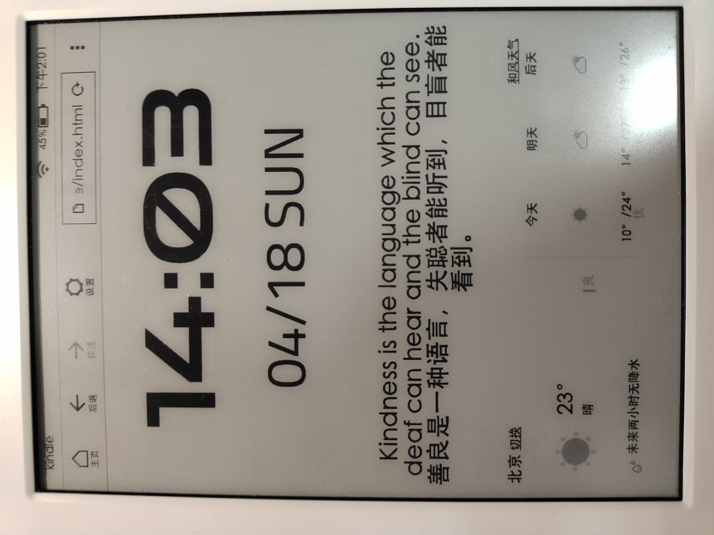
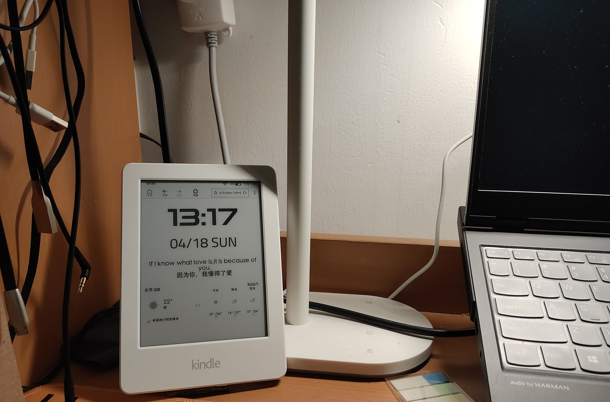
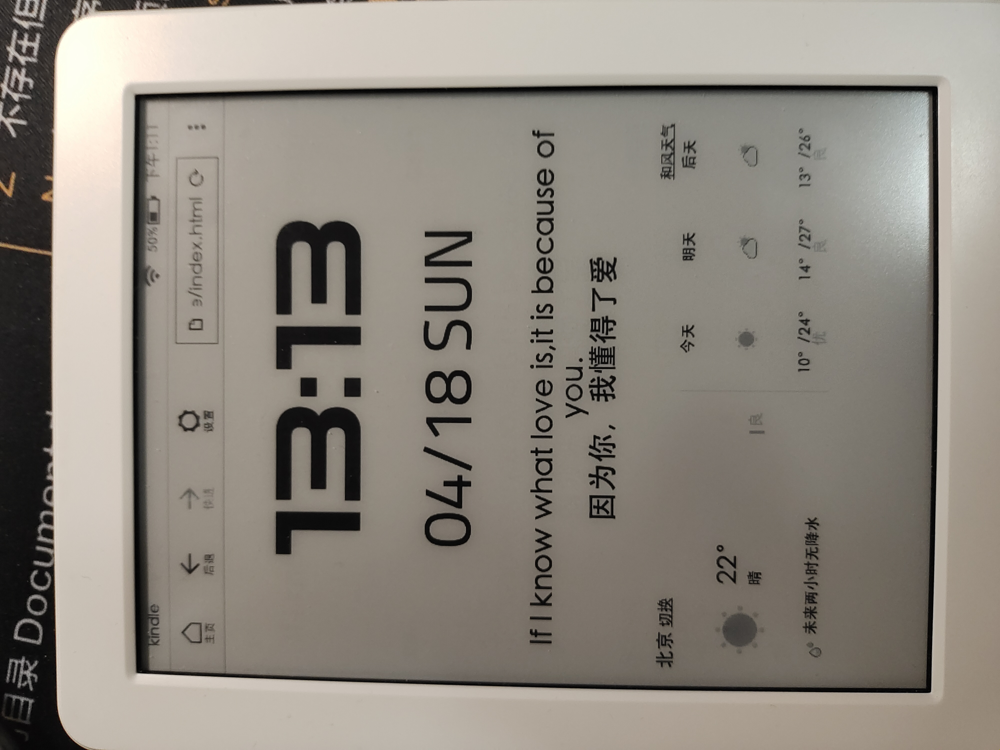

# * Kindle Weather Time

## 1.效果

## 2.技术框架

- HTML

- CSS

- JS

## 3.文件说明

- 主要文件index.html，没有单独把JS，CSS提取出来

- 字体引用 https://fonts.google.com

- 时间日期显示，均用JS实现；英文和翻译使用扇贝每日一句API(由后端代理，解决跨域问题)；

- 天气预报使用和风天气